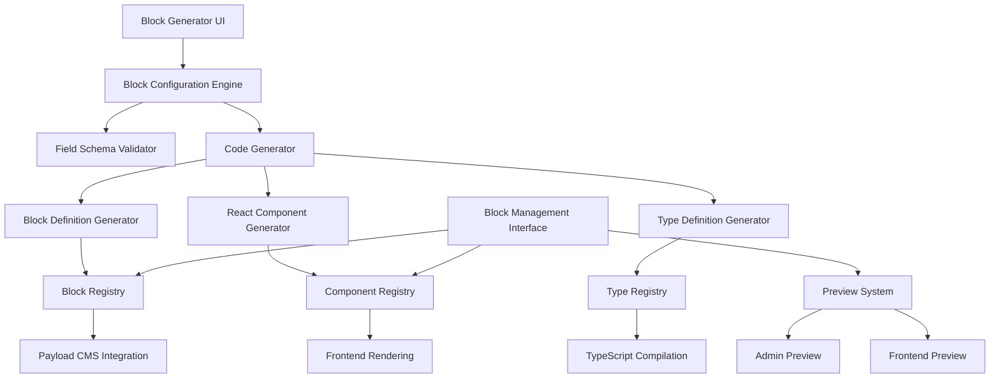

# Block Generation System Design

## Overview

The Block Generation System is a comprehensive solution that enables dynamic creation and management of new block types for the Payload CMS-based franchise website. The system extends the existing block architecture by providing a user-friendly interface for creating custom blocks, generating the necessary code artifacts, and seamlessly integrating them into the CMS workflow.

The system maintains compatibility with the existing block structure while providing powerful customization capabilities through a visual block builder interface.

## Architecture

### High-Level Architecture



### System Components

1. **Block Generator UI**: Web-based interface for creating and configuring blocks
2. **Block Configuration Engine**: Core logic for processing block configurations
3. **Code Generator**: Automated generation of block definitions and components
4. **Block Registry**: Central management system for all block types
5. **Preview System**: Real-time preview capabilities for generated blocks
6. **Integration Layer**: Seamless integration with existing Payload CMS workflow

## Components and Interfaces

### Block Generator UI Component

**Location**: `src/components/admin/BlockGenerator.tsx`

The main interface component providing:

- Block configuration form with field type selection
- Real-time validation and error display
- Preview integration
- Save/deploy functionality

**Key Features**:

- Drag-and-drop field ordering
- Field type selection with appropriate configuration options
- Conditional field display based on field types
- Integration with existing admin UI patterns

### Block Configuration Engine

**Location**: `src/lib/blockGeneration/configEngine.ts`

Core service responsible for:

- Processing block configuration data
- Validating field schemas and relationships
- Managing block metadata and versioning
- Coordinating with code generation services

**Interface**:

```typescript
interface BlockConfigurationEngine {
  validateConfiguration(config: BlockConfiguration): ValidationResult
  processConfiguration(config: BlockConfiguration): ProcessedBlockConfig
  generateBlockId(name: string): string
  checkNameAvailability(name: string): boolean
}
```

### Code Generator Services

**Location**: `src/lib/blockGeneration/generators/`

Modular code generation services:

1. **Block Definition Generator** (`blockDefinitionGenerator.ts`)
   - Generates Payload CMS block configuration
   - Creates field definitions with proper validation
   - Handles conditional field logic

2. **React Component Generator** (`componentGenerator.ts`)
   - Creates TypeScript React components
   - Implements proper prop interfaces
   - Follows existing component patterns and styling

3. **Type Definition Generator** (`typeGenerator.ts`)
   - Generates TypeScript interfaces
   - Creates proper type exports
   - Maintains type safety across the system

### Block Registry System

**Location**: `src/lib/blockGeneration/registry/`

Central management system providing:

- Block registration and deregistration
- Version management and rollback capabilities
- Usage tracking and dependency management
- Integration with Payload CMS collection updates

**Interface**:

```typescript
interface BlockRegistry {
  registerBlock(blockConfig: GeneratedBlockConfig): Promise<void>
  unregisterBlock(blockId: string): Promise<void>
  getBlock(blockId: string): GeneratedBlockConfig | null
  listBlocks(): GeneratedBlockConfig[]
  updateBlock(blockId: string, config: GeneratedBlockConfig): Promise<void>
}
```

### Preview System

**Location**: `src/components/admin/BlockPreview.tsx`

Real-time preview capabilities:

- Admin interface preview showing field configuration
- Frontend preview with sample data
- Responsive design testing
- Integration with existing styling system

## Data Models

### Block Configuration Schema

```typescript
interface BlockConfiguration {
  id: string
  name: string
  slug: string
  description?: string
  category?: string
  fields: FieldConfiguration[]
  metadata: {
    version: string
    createdAt: Date
    updatedAt: Date
    createdBy: string
  }
  settings: {
    allowMultiple: boolean
    defaultPublished: boolean
    adminDescription?: string
  }
}

interface FieldConfiguration {
  name: string
  type: FieldType
  label: string
  description?: string
  required: boolean
  defaultValue?: any
  validation?: ValidationRules
  admin?: AdminConfiguration
  conditional?: ConditionalLogic
}

type FieldType =
  | 'text'
  | 'textarea'
  | 'richText'
  | 'number'
  | 'checkbox'
  | 'select'
  | 'upload'
  | 'relationship'
  | 'array'
  | 'group'
  | 'color'

interface ValidationRules {
  min?: number
  max?: number
  pattern?: string
  options?: SelectOption[]
  relationTo?: string
}

interface AdminConfiguration {
  position?: 'main' | 'sidebar'
  width?: string
  placeholder?: string
  condition?: string
}

interface ConditionalLogic {
  field: string
  operator: 'equals' | 'not_equals' | 'in' | 'not_in'
  value: any
}
```

### Generated Block Artifacts

```typescript
interface GeneratedBlockConfig {
  id: string
  configuration: BlockConfiguration
  artifacts: {
    blockDefinition: string // Generated Payload block config
    componentCode: string // Generated React component
    typeDefinitions: string // Generated TypeScript types
  }
  status: 'draft' | 'active' | 'deprecated'
  usage: {
    pageCount: number
    lastUsed?: Date
  }
}
```

## Error Handling

### Validation Error Handling

The system implements comprehensive validation at multiple levels:

1. **Client-side Validation**: Real-time validation in the UI with immediate feedback
2. **Configuration Validation**: Server-side validation of block configurations
3. **Code Generation Validation**: Validation of generated code artifacts
4. **Integration Validation**: Validation of CMS integration and compatibility

**Error Types**:

- `ValidationError`: Field configuration and schema validation errors
- `GenerationError`: Code generation and compilation errors
- `RegistrationError`: Block registration and CMS integration errors
- `ConflictError`: Name conflicts and dependency issues

### Error Recovery

- Automatic rollback on failed deployments
- Draft mode for testing configurations
- Validation warnings for potential issues
- Graceful degradation for missing dependencies

## Testing Strategy

### Unit Testing

**Location**: `src/lib/blockGeneration/__tests__/`

- **Configuration Engine Tests**: Validate configuration processing and validation logic
- **Code Generator Tests**: Test generated code quality and correctness
- **Registry Tests**: Test block registration and management functionality
- **Validation Tests**: Comprehensive validation rule testing

### Integration Testing

**Location**: `src/__tests__/integration/blockGeneration/`

- **End-to-End Block Creation**: Test complete block creation workflow
- **CMS Integration Tests**: Validate Payload CMS integration
- **Component Rendering Tests**: Test generated component rendering
- **Preview System Tests**: Validate preview functionality

### Component Testing

**Location**: `src/components/admin/__tests__/`

- **Block Generator UI Tests**: Test user interface functionality
- **Preview Component Tests**: Test preview rendering and interaction
- **Form Validation Tests**: Test form validation and error handling

### Performance Testing

- **Code Generation Performance**: Measure generation time for complex blocks
- **Registry Performance**: Test block lookup and management performance
- **Preview Rendering Performance**: Validate preview system responsiveness

## Implementation Phases

### Phase 1: Core Infrastructure

- Block Configuration Engine
- Basic Code Generators
- Block Registry System
- Foundation UI Components

### Phase 2: User Interface

- Block Generator UI
- Field Configuration Interface
- Basic Preview System
- Validation and Error Handling

### Phase 3: Advanced Features

- Advanced Field Types (richText, relationship, array)
- Conditional Logic System
- Advanced Preview Features
- Block Management Interface

### Phase 4: Integration & Polish

- Complete CMS Integration
- Performance Optimization
- Comprehensive Testing
- Documentation and Training Materials

## Security Considerations

### Code Generation Security

- Sanitization of user input in generated code
- Prevention of code injection attacks
- Validation of generated code before deployment

### Access Control

- Role-based access to block generation features
- Audit logging for block creation and modifications
- Approval workflow for block deployment

### Data Validation

- Strict validation of all configuration inputs
- Prevention of malicious field configurations
- Sanitization of block names and identifiers

## Performance Considerations

### Code Generation Optimization

- Caching of generated code artifacts
- Incremental generation for configuration changes
- Lazy loading of preview components

### Runtime Performance

- Efficient block registry lookups
- Optimized component rendering
- Minimal impact on existing page load times

### Scalability

- Support for large numbers of generated blocks
- Efficient storage and retrieval of block configurations
- Horizontal scaling capabilities for high-traffic scenarios
